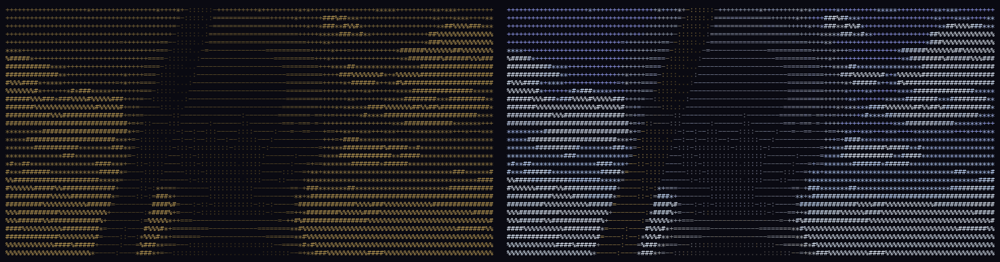

<p align="center">
  
</p>

<h1 align="center">D A G A S H I</h1>

<p align="center">
  <strong>Your keystrokes, digested into anime ASCII art.</strong>
</p>

<p align="center">
  
  
  
  
</p>

---

A desktop app that counts your keystrokes, then turns them into gacha pulls of animated ASCII art from 300 top anime. More popular anime = rarer pulls.

Includes a **Dynamic Island** overlay at the macOS notch — a pixel art dagashi shop with walking characters, that expands to show your latest pull.

## Quick Start

```bash
git clone https://github.com/tomyangdev/dagashi.git
cd dagashi && pnpm install
./scripts/install.sh
./scripts/start.sh
```

**Requires:** macOS 14+, Rust, pnpm, [Claude Code CLI](https://claude.ai/claude-code)

## How It Works

1. A daemon counts keystrokes (never records what you type — only counts)
2. Every hour, your stats trigger a gacha pull
3. Claude picks a character matching your typing personality
4. A GIF is fetched, converted to ASCII art, and rendered

## The Gacha

300 anime from MAL, ranked by popularity.

| Rarity | Rank | Examples |
|--------|------|----------|
| **Legendary** | #1-10 | Attack on Titan, Death Note |
| **Epic** | #11-50 | Steins;Gate, Gintama |
| **Rare** | #51-150 | Monster, Trigun |
| **Uncommon** | #151-250 | Mid-tier discoveries |
| **Common** | #251-300 | Edge of the top 300 |

## Dynamic Island

A standalone Swift app that sits at the macOS notch.

- **Collapsed:** pixel art dagashi shop with walkers and bikers
- **Expanded:** click to reveal latest pull as animated ASCII art
- **Auto-cycles:** color clean → color block → mono clean → mono block
- Watches `~/.dagashi/` for new pulls

## Scripts

```bash
./scripts/start.sh      # Start daemon + app + island
./scripts/stop.sh        # Stop everything
./scripts/dev.sh         # Build from source + launch
./scripts/rebuild.sh     # Full rebuild + install + start
```

## Architecture

Three processes, shared filesystem (`~/.dagashi/`):

| Component | Stack | Role |
|-----------|-------|------|
| **dagashi-daemon** | Rust + Swift | Keystroke capture via CGEventTap |
| **Dagashi.app** | Tauri v2 (Rust + JS) | UI, gacha pulls, gallery |
| **DagashiIsland** | Swift/SwiftUI | Dynamic Island overlay at notch |

## Privacy

Only aggregate stats — character frequencies, hourly volume, key regions. No words, no sentences, no order. **Deaf mode** instantly pauses recording.

## Credits

[Press Start 2P](https://fonts.google.com/specimen/Press+Start+2P) | [Jikan API](https://jikan.moe) | [Tenor](https://tenor.com) | [Klipy](https://klipy.com) | [Pinata](https://www.pinata.cloud)

## License

MIT
