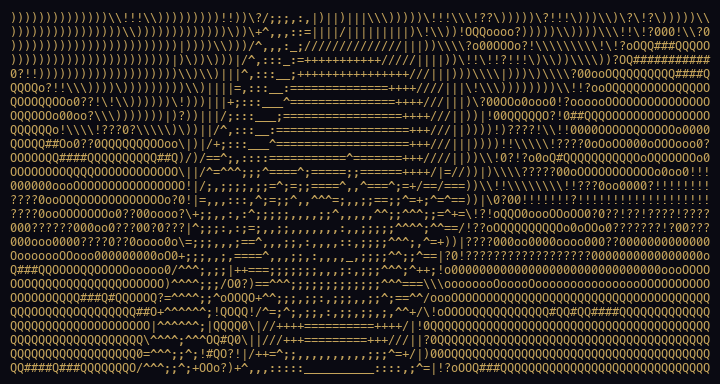
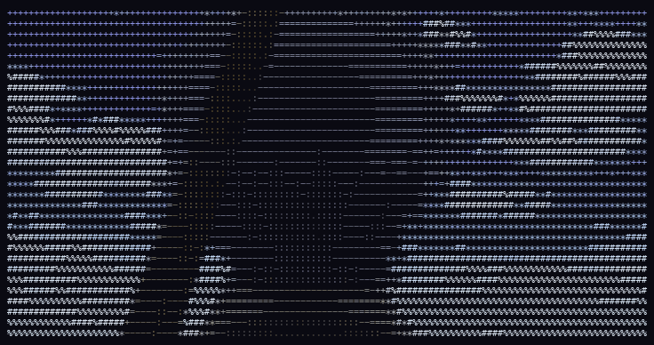

<h1 align="center">D A G A S H I</h1>

<em>your keystrokes, digested into art</em>

A completely useless Tauri desktop app that records your keystrokes all day, 
then uses them to generate animated ASCII art of Gintama characters every night.  
Type all day. Get cheap candy art. Like dagashi.

<table align="center">
<tr>
<td align="center"><strong>mono</strong></td>
<td align="center"><strong>color</strong></td>
</tr>
<tr>
<td></td>
<td></td>
</tr>
</table>
