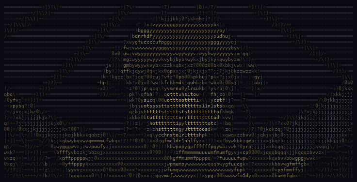
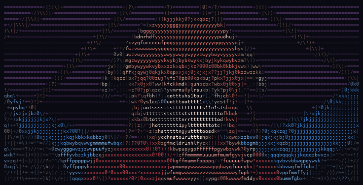

<p align="center">
  
</p>

<h1 align="center">D A G A S H I</h1>

<p align="center">
  <strong>Your keystrokes, digested into anime ASCII art.</strong>
</p>

<p align="center">
  
  
  
  
  
</p>

---

Dagashi is a desktop app that silently records your keystrokes all day, then at 11:59 PM uses them to generate a gacha pull of animated ASCII art from 1000+ anime series. More popular anime are rarer pulls. Your typing patterns determine which character you get.

It is completely, utterly, magnificently **useless**.

<table align="center">
<tr>
<td align="center"><strong>Kagura — mono</strong></td>
<td align="center"><strong>Kagura — color</strong></td>
</tr>
<tr>
<td></td>
<td></td>
</tr>
</table>

<p align="center"><em>ASCII art rendered using your actual keystroke characters — <code>e t a o i n s r</code> become your pixels</em></p>

## How It Works

```
  Terminal (daemon)                    Dagashi.app (UI)
 ┌──────────────────┐               ┌──────────────────┐
 │ dagashi-daemon   │   writes to   │  Reads stats     │
 │                  │──────────────►│  from disk        │
 │ Captures ALL     │  ~/.dagashi/  │                  │
 │ keystrokes via   │  stats/*.json │  Shows keyboard  │
 │ CGEventTap       │               │  heatmap, pulls, │
 │                  │               │  gallery, roster  │
 └──────────────────┘               └──────────────────┘
```

1. **Type normally.** A lightweight daemon runs in your terminal, counting every keystroke globally. It never records what you type — only how much and which keys. No passwords, no credit cards, nothing reconstructable.

2. **At 11:59 PM, your daily pull triggers automatically.** Your keystroke volume determines the rarity odds. More typing = better chance of a rare pull. But even a lazy day has a shot at legendary.

3. **An AI picks your character.** Based on your typing stats — backspace ratio, shift usage, peak hours — Claude interprets your "typing personality" and picks a character + scene that matches.

4. **Animated ASCII art appears.** A GIF of that character is fetched, converted to ASCII art using your actual typed characters as pixels, and rendered in a retro pixel UI with a live keyboard heatmap.

5. **Collect them all.** Your pull is saved to a gallery. Every day is a new pull. Rarity shifts over time as anime popularity changes.

## The Gacha

1000 anime from [MyAnimeList](https://myanimelist.net) (via Jikan API), ranked by popularity. **More popular = rarer.**

| Rarity | Rank | Examples |
|--------|------|----------|
| **Legendary** | #1-25 | Attack on Titan, Death Note, One Punch Man, Naruto |
| **Epic** | #26-100 | Steins;Gate, Gintama, Mob Psycho 100, Cowboy Bebop |
| **Rare** | #101-300 | Monster, Trigun, Great Teacher Onizuka |
| **Uncommon** | #301-600 | Mid-tier shows you might discover |
| **Common** | #601-1000 | Obscure gems waiting to be found |

The anime database refreshes every 14 days. A show that's Common today could become Rare tomorrow if it blows up. Your collection's value is alive.

## Privacy

Dagashi records keystrokes but **never stores what you typed**. Only aggregate stats:

- Character frequencies (`e: 4312, t: 3100, ...`)
- Category counts (letters, numbers, symbols)
- Hourly volume patterns
- Key region heatmaps (left hand vs right hand)

No words. No sentences. No order. A **deaf mode** toggle instantly stops all recording when you're typing sensitive info.

## Features

- **Live keyboard heatmap** — see your typing patterns in real-time
- **Daily auto-pull** at 11:59 PM with countdown timer
- **Mono + color** ASCII art rendered with your keystroke characters
- **1000+ anime** from MyAnimeList with popularity-based rarity
- **AI character selection** via Claude CLI — interprets your typing personality
- **Gallery** of past pulls with replay
- **Roster** showing all 1000 anime with rarity tiers and MAL scores
- **Deaf mode** — one-click pause on keystroke recording
- **Retro pixel UI** — Press Start 2P font, CRT scanlines, amber-on-dark
- **All keys captured** — letters, numbers, `⌘` `⌥` `⇧` `⌃` `⏎` `⌫` arrows, function keys

## Installation

### Prerequisites

- **macOS** (with Input Monitoring permission for the terminal)
- **Rust** — `curl --proto '=https' --tlsv1.2 -sSf https://sh.rustup.rs | sh`
- **pnpm** — `npm install -g pnpm`
- **[Claude Code CLI](https://claude.ai/claude-code)** — for AI character selection during pulls

### Build from Source

```bash
# Clone
git clone https://github.com/tomyangdev/dagashi.git
cd dagashi

# Build the daemon (keystroke capture)
cd daemon && cargo build --release && cd ..

# Build the app (UI)
pnpm install
pnpm tauri build --bundles app

# Copy app to Applications
cp -R src-tauri/target/release/bundle/macos/Dagashi.app /Applications/
```

### Run

```bash
# Just open the app — it auto-launches the daemon in Terminal
open /Applications/Dagashi.app
```

On first launch:
1. A Terminal window opens running the keystroke daemon
2. macOS may prompt for **Input Monitoring** permission — grant it
3. Start typing — the keyboard heatmap lights up in real-time
4. Wait for 11:59 PM or manually trigger a pull

### Manual Start (if auto-launch doesn't work)

```bash
# Terminal 1: Start the daemon
~/dagashi/daemon/target/release/dagashi-daemon

# Terminal 2 (or double-click): Open the app
open /Applications/Dagashi.app
```

## Architecture

Two processes, shared filesystem:

| Component | Language | Role |
|-----------|----------|------|
| **dagashi-daemon** | Rust + Swift helper | Captures keystrokes globally via CGEventTap, writes stats JSON to `~/.dagashi/stats/` every 2 seconds |
| **Dagashi.app** | Rust (Tauri v2) + JS | Reads stats from disk, renders UI, runs gacha pulls, manages gallery |

```
~/.dagashi/
├── stats/
│   └── 2026-04-10.json    ← daemon writes, app reads
├── pulls/
│   └── 2026-04-10/
│       ├── meta.json       ← character, rarity, flavor text
│       └── frames.json     ← ASCII art pixel data
├── collection.json         ← all pulls indexed
├── anime_db.json           ← 1000 anime cached from MAL
├── config.json             ← user settings
└── bin/
    └── dagashi-keytap      ← compiled Swift helper for CGEventTap
```

## Tech Stack

| Layer | Technology | Purpose |
|-------|-----------|---------|
| Daemon | Rust + Swift | Keystroke capture via CGEventTap |
| App | Tauri v2 | Rust backend + webview frontend |
| Frontend | Vanilla JS | Retro pixel UI, ASCII renderer, keyboard heatmap |
| AI | Claude CLI | Character selection from typing personality |
| Images | Giphy API | Animated GIF search for anime characters |
| Anime DB | Jikan API | 1000 anime ranked by MAL popularity |

## Why "Dagashi"?

[Dagashi](https://en.wikipedia.org/wiki/Dagashi) (駄菓子) are cheap Japanese penny candies — the kind you find in corner stores for a few yen. Worthless, nostalgic, and they bring inexplicable joy. Like this app.

The characters in Gintama literally hang out at a dagashi shop. It felt right.

## Roadmap

- [ ] Reveal animation with rarity-specific effects
- [ ] IPFS pull receipts for verifiable collection
- [ ] Server-side gacha rolls for anti-cheat
- [ ] Multiplayer leaderboard and collection comparison
- [ ] Mobile port (Tauri v2 supports iOS/Android)
- [ ] Nerd Font character rendering for special keys
- [ ] Launch Agent for auto-start daemon at login

## License

MIT
